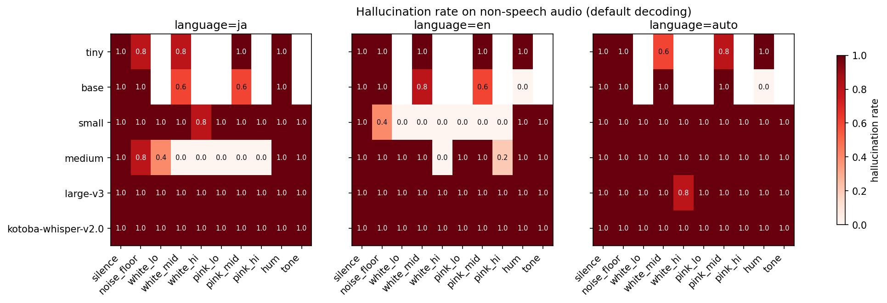
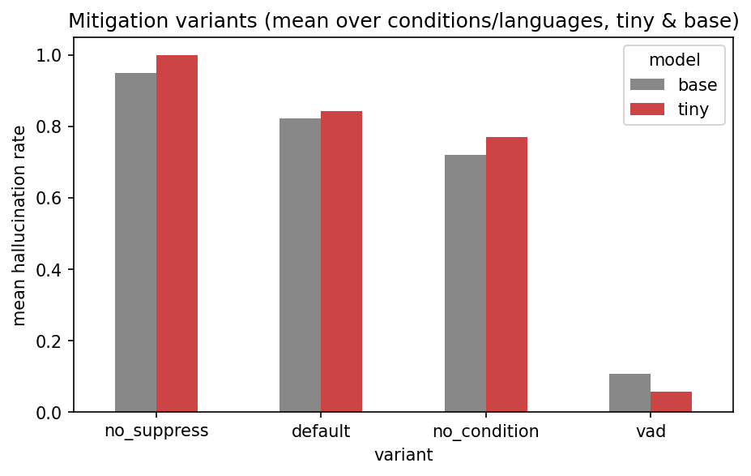
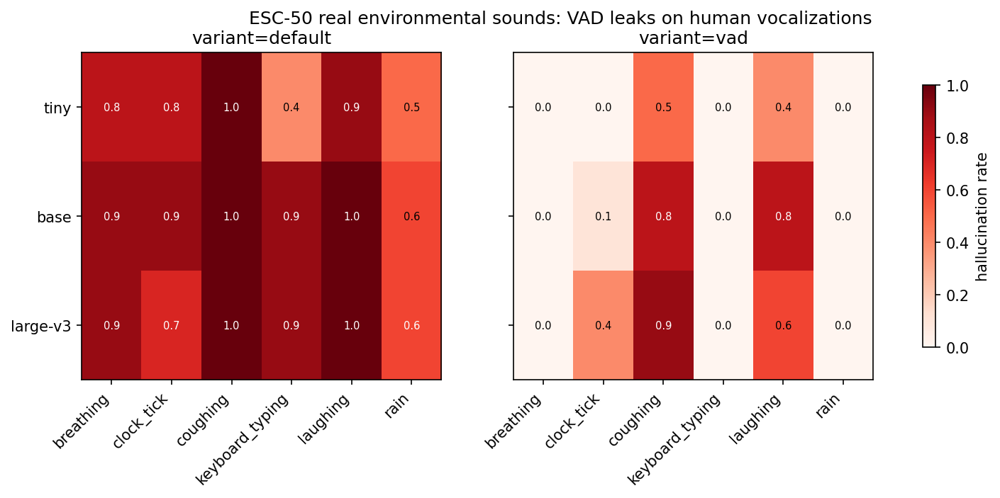

# 無音を文字起こしすると「ご視聴ありがとうございました」になる理由を、1450回の実験で確かめた

Whisper で文字起こしをしていると、誰も何も話していないのに「ご視聴ありがとうございました」と出力されることがあります。X や Togetter でも定期的に話題になる、わりと有名な現象です。

「YouTube の字幕を学習してるからでしょ」という説明もセットでよく見かけます。理屈としてはなんとなく分かるのですが、

- 本当に訓練データ由来と言えるのか
- モデル（サイズ・系統）によってどう変わるのか
- 環境音があると変わるのか
- なぜパラメータをいじっても消えないのか

を、根拠を持って説明できる状態にしたかったので、手元でまとめて実験しました。合計 1,450 試行です。

先行研究としては、非音声入力による Whisper のハルシネーションを体系的に調べたこちらの論文をアンカーにしています。

https://arxiv.org/abs/2501.11378

ほかに、Whisper API の書き起こしの約 1% に捏造フレーズが含まれ、無音ポーズの長い失語症話者ほど幻覚が増えると報告した FAccT 2024 の Koenecke らの論文、デコーダ末尾層の少数の attention head が非音声幻覚の大半を駆動していると特定した Calm-Whisper（Interspeech 2025）も参照しました。

https://arxiv.org/abs/2402.08021

https://arxiv.org/abs/2505.12969

## 実験設計

音声はすべて合成で作りました（30 秒、16kHz mono）。

- 完全なデジタル無音（全ゼロ）
- マイクのノイズフロア相当の微小白色雑音（-80dBFS）
- 白色雑音・ピンク雑音（-60 / -40 / -20dBFS の 3 レベル）
- 50Hz ハム（空調・電源）、440Hz 純音

これに加えて、実環境音として ESC-50 データセットから雨・キーボード打鍵・時計の秒針・咳・呼吸・笑い声の 6 カテゴリ × 5 クリップを使いました。

モデルは次の 3 系統です。

| 系統 | モデル | 見たいこと |
|---|---|---|
| Whisper (faster-whisper) | tiny / base / small / medium / large-v3 | サイズ依存性 |
| 日本語特化蒸留 | kotoba-whisper-v2.0 | 蒸留で消えるか |
| CTC（デコーダLMなし） | wav2vec2 日本語 / 英語 | 対照実験 |

言語設定（ja / en / 自動判定）と、緩和策（VAD 前段フィルタ、`condition_on_previous_text=False`、内蔵抑制の無効化）もスイープしました。デコードは beam=5、temperature=0 で固定です。

## 結果 1: large-v3 は無音の 100% で「ご視聴ありがとうございました」と言う

まず一番インパクトのあった結果から。**large-v3 に `language=ja` で非音声を渡すと、38 試行すべてで「ご視聴ありがとうございました」が出ました**。無音でもノイズフロアでも白色雑音でもハムでも、全部この一句です。



「大きいモデルなら賢いから幻覚しない」ではなく、逆でした。モデルが大きいほど「無音 → 定型句」の対応が強く、一貫して現れます。

ただし、ハルシネーションの「型」はサイズで質的に変わります。

| モデル | ja での典型出力 |
|---|---|
| tiny | 「ご視聴ありがとうございました」、数字列ループ |
| base | 「スタッフを見つけたらスタッフを見つけたら…」（反復ループ） |
| small | 「んんんんんん…」（退化した反復） |
| medium | 「あなたはあなたは…」、「この動画をご視聴頂き申し訳ございません ご視聴頂きありがとうございました」 |
| large-v3 | 「ご視聴ありがとうございました」一択 |

小さいモデルは流暢さの低い反復・退化系列に落ち、大きいモデルは流暢な訓練データ定型句に落ちる。デコーダの言語モデルが強いほど、高頻度字幕フレーズという「引き込み先（attractor）」がはっきりする、と読めます。

## 結果 2: 言語を変えると定型句が変わる。ただし意味は同じ

訓練データ由来説の一番きれいな証拠がこれです。**まったく同じ無音**に対して、large-v3 は言語トークンだけでこう変わります。

- `language=ja` →「ご視聴ありがとうございました」
- `language=en` → "Thank you." / "Thank you for watching."
- 自動判定 → 上記に加えてウェールズ語の "Diolch yn fawr"（=どうもありがとう）

3 言語とも「視聴への感謝」という**同じ意味**に収束します。動画の末尾、無音区間に載る感謝字幕（日本語なら「ご視聴ありがとうございました」、英語なら "Thanks for watching!"）が言語ごとに学習されている、という説明そのものの挙動です。

なお、有名な「チャンネル登録ありがとうございます」は今回 1,450 試行で 0 件でした。日本語の無音 attractor は「ご視聴ありがとうございました」が支配的です（74 件）。ほかに ESC-50 の環境音に対しては「おやすみなさい」「音楽」「音量を調整します。」という、これも字幕・キャプション臭の強い定型句が出ました。

## 結果 3: CTC モデルは一切幻覚しない

「幻覚の発生源はデコーダの言語モデル」という説明を確かめるための対照実験です。デコーダ LM を持たない CTC モデル（wav2vec2 系、日本語・英語各 1）に同じ非音声を入力すると、**非空出力は 0/76**。完全な無出力です。

CTC はフレームごとの音響分類 + blank 縮約なので、音響エビデンスがなければ blank に潰れるだけです。「音を聞き間違えている（エンコーダの問題）」のではなく、「音がないときにデコーダが作文している」ことが、系統間の対照ではっきり分かれました。

## 結果 4: なぜパラメータ調整では消えないのか

Whisper には無音対策の抑制ロジックが内蔵されています。セグメントが破棄されるのは

```
no_speech_prob > 0.6  かつ  avg_logprob < -1.0
```

の **AND 条件**が成立したときです。ここで無音時の内部指標を見ると、

- `no_speech_prob ≈ 0.94` （モデルは「音声なし」とほぼ確信している）
- `avg_logprob ≈ -0.9` （それでも生成テキストには自信がある）

つまりモデルは「無音だと分かった上で、自信を持って幻覚」します。avg_logprob が閾値を下回らないので AND 条件が成立せず、抑制をすり抜けます。定型句は訓練データ上の高頻度系列なので、生成確率が高い＝logprob が高いのは必然で、アンカー論文が「パラメータ調整の効果は限定的」と報告しているのはこの構造のためだと解釈できます。

実際、抑制を全部切ると幻覚率はほぼ 100%、既定設定で 60〜100%、`condition_on_previous_text=False` はほぼ効果なしでした。



## 結果 5: VAD は効く。ただし咳と笑い声で破れる

唯一ちゃんと効いたのは VAD（Silero-VAD）の前段フィルタで、合成音（無音・雑音・ハム・純音）に対しては**全条件 0%** でした。

ところが実環境音を入れると話が変わります。



雨・キーボード・呼吸は VAD で 0% に落ちる一方、**咳は 50〜90%、笑い声は 40〜80% が VAD を通過**して、その先で「ご視聴ありがとうございました」や「はっはっはっ…」「wwww」が生成されます。VAD が人間由来の音を「音声」と判定してしまうためです。

これは実務的にけっこう重要で、「VAD を入れたから大丈夫」ではなく、**咳・笑い・相槌の多い会議録や診察録こそ危険**ということになります。Koenecke らが失語症話者（発話間ポーズが長い）で幻覚率の上昇を報告しているのと同じ構図です。

## おまけ: 蒸留モデルは「ごめん。」と謝り続ける

日本語特化の蒸留モデル kotoba-whisper-v2.0 は、全 114 試行で「ごめん。」という出力でした。蒸留で幻覚が消えるのではなく、attractor が別の句（おそらく蒸留データの ReazonSpeech 由来）に置き換わった形です。

※ こちらは transformers パイプライン経由で、faster-whisper の抑制ロジックが効いていない状態での測定なので、実運用比較には同一スタックでの再測定が必要です。

## まとめ: 「無音→ご視聴ありがとうございました」の説明ロジック

1. **訓練データ由来**: Whisper は Web 動画の字幕を含む弱教師付きデータ 68 万時間で学習されており、動画末尾の無音区間に載る感謝字幕を「無音の書き起こし」として学習している。証拠: 言語トークンを変えるだけで ja/en/cy それぞれの「視聴への感謝」定型句に切り替わる。
2. **デコーダ LM の attractor**: 無音・定常音では音響エビデンスが乏しく、出力はデコーダ内部言語モデルの高頻度系列に引き込まれる。モデルが大きいほど純粋に発現する（large-v3 ja で 100%）。
3. **自信のある幻覚**: 定型句は生成確率が高いため、`no_speech_prob` が 0.94 でも `avg_logprob` が閾値を下回らず、内蔵抑制（AND 条件）をすり抜ける。パラメータ調整で消えないのはこのため。
4. **発生源はデコーダ**: デコーダ LM を持たない CTC モデルは同一入力で非空出力 0/76。
5. **対策は多段防御**: VAD 前段フィルタは定常音に完璧だが、咳・笑いなど人間由来の非言語音で 40〜90% すり抜ける。VAD + 既知定型句フィルタ + `no_speech_prob` の単独利用（AND 条件にしない）の組み合わせが現実解。

## 制約と注意

- ノイズは白色・ピンク・ハム・純音の合成音が中心で、実環境音は ESC-50 の 6 カテゴリのみ。音楽や babble（人混みの話し声）は未検証です。
- 各条件 5 シード、CPU int8（faster-whisper）での単一実行なので、率の細かい数字には幅があります。
- kotoba-whisper はデコードスタックが異なるため、Whisper 系との率の直接比較はできません。

コードと生ログはリポジトリの `studies/07_asr-silence-hallucination/` にあります。音声合成 → 書き起こし → 集計まで全部スクリプト化してあるので、条件を足しての追試は簡単です。

## 参考文献

- Barański et al., "Investigation of Whisper ASR Hallucinations Induced by Non-Speech Audio" (2025) — https://arxiv.org/abs/2501.11378
- Koenecke et al., "Careless Whisper: Speech-to-Text Hallucination Harms" (FAccT 2024) — https://arxiv.org/abs/2402.08021
- Wang et al., "Calm-Whisper: Reduce Whisper Hallucination On Non-Speech By Calming Crazy Heads Down" (Interspeech 2025) — https://arxiv.org/abs/2505.12969
- Frieske & Shi, "Hallucinations in Neural Automatic Speech Recognition" (2024) — https://arxiv.org/abs/2401.01572
- Radford et al., "Robust Speech Recognition via Large-Scale Weak Supervision" (2022) — https://arxiv.org/abs/2212.04356
- ESC-50: Piczak, "ESC: Dataset for Environmental Sound Classification" (2015, CC BY-NC 3.0) — https://github.com/karolpiczak/ESC-50

（Zenn 公開時は画像をエディタにアップロードして `` の URL を差し替えること）
